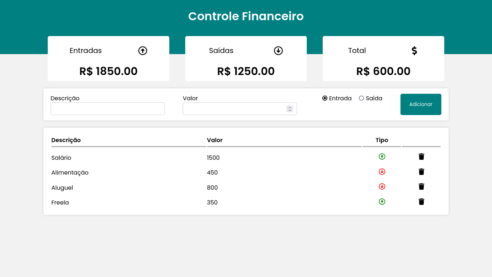

<h1 align="center"> React Finance </h1>

  <a href="#-tecnologias">Tecnologias</a>&nbsp;&nbsp;&nbsp;|&nbsp;&nbsp;&nbsp;
  <a href="#-projeto">Projeto</a>&nbsp;&nbsp;&nbsp;|&nbsp;&nbsp;&nbsp;
  <a href="#gear-funcionamento">Funcionamento</a>

  

 

  

## 🚀 Tecnologias

Esse projeto foi desenvolvido com as seguintes tecnologias:

- HTML
- CSS
- Javascript
- React
- Styled Components

## 💻 Projeto

Aplicativo de gestão de finanças desenvolvido em React com Styled Components. O projeto foi criado com o intuito de aprender mais a respeito das tecnologias envolvidas. O projeto foi desenvolvido utilizando como base de estudo o vídeo que vocẽ pode acessar [nesse link](https://www.youtube.com/watch?v=pj4vA67olbU&t=959s).

## :gear: Funcionamento

- Rode o comando "npm start" no terminal da raiz do projeto
- Abra uma aba no navegador na porta indicada
- Use e teste o aplicativo à vontade

---
